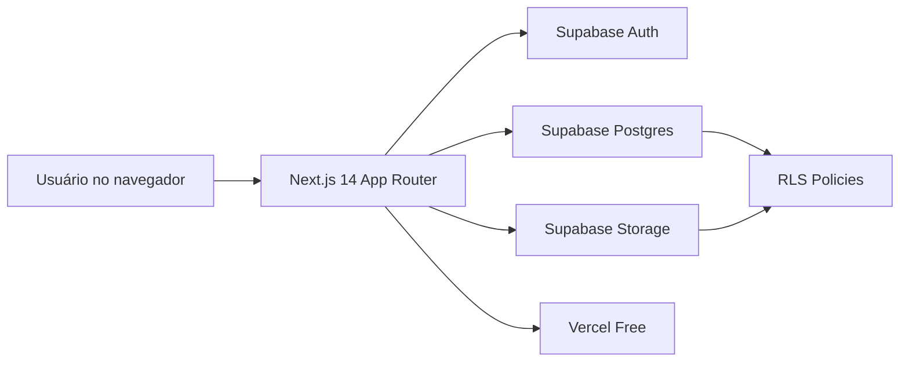
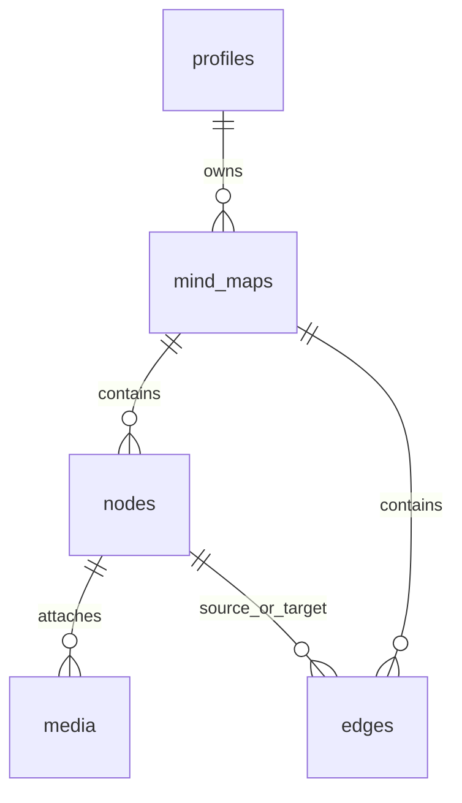
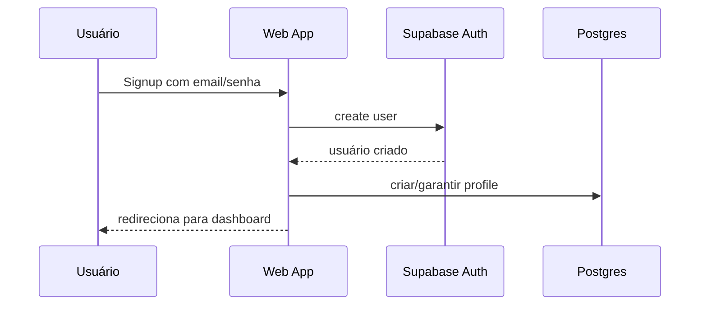

# Objetivo

Construir uma plataforma web de **Mapa Mental** com autenticação, CRUD de mapas, editor visual de nós e conexões, suporte a **fotos e vídeos por nó**, e operação em **camada gratuita** usando **Next.js 14+**, **Supabase Free** e **Vercel Free**.

## Decisão de biblioteca para mapa mental

### Avaliação resumida
- **React Flow (xyflow)**
  - Prós: ecossistema maduro, excelente suporte a TypeScript, modelagem nativa de nós/arestas, eventos de drag/connect/edit, boa documentação, custom nodes, viewport controls, mini map, selection e persistência simples em JSON.
  - Contras: exige adaptar a UX para “mind map” em vez de fluxo genérico; alguns recursos avançados exigem cuidado de performance.
- **Alternativas rejeitadas**
  - Implementação custom com SVG/Canvas: maior custo de desenvolvimento e manutenção.
  - Bibliotecas legadas de mind map: em geral menos flexíveis, pior integração com React moderno, menos suporte a customização de mídia e persistência relacional.

### Escolha
**Escolher React Flow (xyflow)** como base do editor visual.

**Motivo:** é a opção com melhor equilíbrio entre produtividade, flexibilidade, custo zero, integração com React/Next.js e capacidade de evoluir o editor com nós customizados contendo texto, imagem e vídeo.

---

# 1. Arquitetura geral

## Visão de alto nível



## Componentes principais

### Frontend web
- **Next.js 14+ com App Router e TypeScript**
- Renderização híbrida:
  - páginas públicas e auth com SSR/CSR conforme necessidade
  - editor de mapa com foco em experiência client-side
- Componentes principais:
  - `app/(auth)/login/page.tsx`
  - `app/(auth)/signup/page.tsx`
  - `app/(dashboard)/maps/page.tsx`
  - `app/(dashboard)/maps/[id]/page.tsx`
  - `components/mindmap/mindmap-canvas.tsx`
  - `components/mindmap/custom-node.tsx`
  - `components/media/media-upload.tsx`
  - `components/auth/auth-form.tsx`

### Backend gerenciado
- **Supabase Auth**
  - email/senha
  - OAuth Google opcional
- **Supabase Postgres**
  - persistência de perfis, mapas, nós, arestas e metadados de mídia
- **Supabase Storage**
  - bucket para imagens e vídeos anexados aos nós
- **RLS (Row Level Security)**
  - isolamento por usuário dono do mapa

### Hospedagem
- **Vercel Free**
  - deploy do frontend Next.js
  - variáveis de ambiente para integração com Supabase

## Como os componentes se comunicam

### Fluxo principal
1. Usuário autentica via interface Next.js.
2. Sessão é gerenciada pelo Supabase Auth.
3. Dashboard consulta mapas do usuário no Postgres.
4. Editor carrega mapa, nós, arestas e mídias associadas.
5. Alterações no canvas disparam persistência incremental no banco.
6. Upload de imagem/vídeo vai para o Storage.
7. Metadados do arquivo são gravados na tabela `media` e vinculados ao nó.
8. RLS garante acesso apenas ao proprietário.

### Estratégia de sincronização
- **Fase inicial:** persistência por ação relevante:
  - criar/editar/remover nó
  - criar/remover conexão
  - mover nó com debounce
- **Formato persistido:** nós e arestas normalizados em tabelas próprias, evitando blob único grande.
- **Benefício:** consultas simples, melhor controle de integridade e possibilidade de filtros/analytics futuros.

---

# 2. Modelo de dados

## Entidades
- `profiles`: dados complementares do usuário autenticado
- `mind_maps`: mapa mental do usuário
- `nodes`: nós do mapa
- `edges`: conexões entre nós
- `media`: fotos e vídeos vinculados a nós

## Relacionamentos



## SQL DDL sugerido (Supabase/Postgres)

```sql
create extension if not exists pgcrypto;

create table if not exists public.profiles (
  id uuid primary key references auth.users(id) on delete cascade,
  full_name text,
  avatar_url text,
  created_at timestamptz not null default now(),
  updated_at timestamptz not null default now()
);

create table if not exists public.mind_maps (
  id uuid primary key default gen_random_uuid(),
  user_id uuid not null references public.profiles(id) on delete cascade,
  title text not null,
  description text,
  root_node_id uuid,
  created_at timestamptz not null default now(),
  updated_at timestamptz not null default now()
);

create table if not exists public.nodes (
  id uuid primary key default gen_random_uuid(),
  mind_map_id uuid not null references public.mind_maps(id) on delete cascade,
  parent_node_id uuid references public.nodes(id) on delete set null,
  label text not null default '',
  notes text,
  pos_x double precision not null default 0,
  pos_y double precision not null default 0,
  color text,
  width integer,
  height integer,
  sort_order integer not null default 0,
  created_at timestamptz not null default now(),
  updated_at timestamptz not null default now()
);

create table if not exists public.edges (
  id uuid primary key default gen_random_uuid(),
  mind_map_id uuid not null references public.mind_maps(id) on delete cascade,
  source_node_id uuid not null references public.nodes(id) on delete cascade,
  target_node_id uuid not null references public.nodes(id) on delete cascade,
  label text,
  edge_type text not null default 'default',
  created_at timestamptz not null default now(),
  constraint edges_no_self_loop check (source_node_id <> target_node_id)
);

create table if not exists public.media (
  id uuid primary key default gen_random_uuid(),
  node_id uuid not null references public.nodes(id) on delete cascade,
  mind_map_id uuid not null references public.mind_maps(id) on delete cascade,
  user_id uuid not null references public.profiles(id) on delete cascade,
  storage_bucket text not null default 'mindmap-media',
  storage_path text not null,
  media_type text not null check (media_type in ('image', 'video')),
  mime_type text not null,
  file_size_bytes bigint not null,
  width integer,
  height integer,
  duration_seconds numeric(10,2),
  preview_image_path text,
  created_at timestamptz not null default now()
);

alter table public.mind_maps
  add constraint mind_maps_root_node_fk
  foreign key (root_node_id) references public.nodes(id) on delete set null;

create index if not exists idx_mind_maps_user_id on public.mind_maps(user_id);
create index if not exists idx_nodes_mind_map_id on public.nodes(mind_map_id);
create index if not exists idx_nodes_parent_node_id on public.nodes(parent_node_id);
create index if not exists idx_edges_mind_map_id on public.edges(mind_map_id);
create index if not exists idx_edges_source_node_id on public.edges(source_node_id);
create index if not exists idx_edges_target_node_id on public.edges(target_node_id);
create index if not exists idx_media_node_id on public.media(node_id);
create index if not exists idx_media_mind_map_id on public.media(mind_map_id);
create index if not exists idx_media_user_id on public.media(user_id);
```

## Regras de consistência
- `mind_maps.user_id` define o proprietário do mapa.
- `nodes` e `edges` sempre pertencem a um `mind_map`.
- `media` deve carregar `node_id`, `mind_map_id` e `user_id` para simplificar políticas e auditoria.
- `root_node_id` é opcional na criação inicial; pode ser definido após o primeiro nó.

## Convenções de path no Storage
- Bucket: `mindmap-media`
- Caminho sugerido:
  - `user_id/mind_map_id/node_id/timestamp-filename.ext`

---

# 3. Fluxo de autenticação

## Métodos suportados
- **Obrigatório:** email/senha
- **Opcional:** Google OAuth

## Fluxo email/senha



## Fluxo de login
1. Usuário envia email/senha.
2. Aplicação autentica no Supabase.
3. Sessão é armazenada de forma segura.
4. Middleware/guard protege rotas privadas.
5. Usuário acessa dashboard e editor apenas autenticado.

## Fluxo Google OAuth opcional
1. Usuário clica em “Entrar com Google”.
2. Supabase redireciona para o provedor.
3. Ao retornar, a aplicação restaura a sessão.
4. `profile` é criado sob demanda caso ainda não exista.

## Estrutura de rotas sugerida
- Públicas:
  - `/login`
  - `/signup`
- Privadas:
  - `/maps`
  - `/maps/[id]`

## Regras de proteção
- Middleware verifica sessão para rotas privadas.
- Usuário autenticado acessando `/login` ou `/signup` pode ser redirecionado para `/maps`.
- Todas as consultas sensíveis dependem também de RLS, não apenas de proteção no frontend.

---

# 4. Estratégia de upload e armazenamento de fotos/vídeos no plano free

## Objetivo
Viabilizar anexos de mídia por nó respeitando o limite de **1 GB de Storage** no Supabase Free e reduzindo consumo de banda/armazenamento.

## Regras gerais
- Limitar tipos aceitos:
  - Imagem: `image/jpeg`, `image/png`, `image/webp`
  - Vídeo: `video/mp4`, idealmente H.264/AAC
- Restringir número de anexos por nó na primeira versão:
  - até **3 imagens** e **1 vídeo** por nó
- Impor limite por mapa e por usuário para evitar abuso.

## Limites recomendados por arquivo
- **Imagem:** até **2 MB** após compressão
- **Vídeo:** até **15 MB** por arquivo
- **Limite total recomendado por usuário na app:** ~**200 MB** lógicos, monitorado pela aplicação, para manter margem no free tier

## Estratégia para imagens
- Compressão no cliente antes do upload.
- Converter preferencialmente para **WebP** quando suportado.
- Redimensionar lado maior para no máximo **1600 px**.
- Gerar preview compacto para listagens, se necessário.

### Pipeline sugerido
1. Usuário seleciona imagem.
2. Cliente valida MIME e tamanho bruto.
3. Cliente comprime/redimensiona.
4. Cliente mostra preview local.
5. Upload vai para Supabase Storage.
6. Metadados persistem na tabela `media`.

## Estratégia para vídeos
- Na primeira versão, **não fazer transcodificação no servidor**, para manter custo zero e simplicidade.
- Orientar o cliente a aceitar apenas vídeos já compactados ou reprocessados localmente quando viável.
- Padrão recomendado:
  - contêiner: **MP4**
  - codec de vídeo: **H.264**
  - codec de áudio: **AAC**
  - resolução máxima: **720p**
  - duração recomendada: até **30 segundos**
  - bitrate alvo: **0,8 a 1,5 Mbps**

### Justificativa
- H.264/MP4 tem ampla compatibilidade nos navegadores.
- 720p é suficiente para preview em nó/modal sem inflar muito o armazenamento.
- Evita depender de processamento backend ou serviços pagos.

## UX de upload recomendada
- Exibir limites claramente antes do envio.
- Bloquear upload acima do limite.
- Exibir progresso.
- Permitir remoção do anexo.
- Mostrar preview:
  - imagem embutida em card/modal
  - vídeo em player leve com poster opcional

## RLS e acesso à mídia

### Estratégia
- Bucket com acesso controlado por usuário dono do mapa.
- Objetos privados por padrão.
- App gera URL assinada quando necessário para preview/download.

### Políticas de banco (conceito)
- Usuário pode ver apenas registros em `media` cujos `user_id` correspondam ao seu `auth.uid()`.
- Usuário pode inserir mídia apenas em nós pertencentes a mapas próprios.
- Usuário pode remover apenas sua própria mídia.

### Políticas RLS sugeridas

```sql
alter table public.profiles enable row level security;
alter table public.mind_maps enable row level security;
alter table public.nodes enable row level security;
alter table public.edges enable row level security;
alter table public.media enable row level security;

create policy "profiles_select_own"
on public.profiles for select
using (auth.uid() = id);

create policy "profiles_insert_own"
on public.profiles for insert
with check (auth.uid() = id);

create policy "profiles_update_own"
on public.profiles for update
using (auth.uid() = id);

create policy "mind_maps_own_all"
on public.mind_maps for all
using (auth.uid() = user_id)
with check (auth.uid() = user_id);

create policy "nodes_own_all"
on public.nodes for all
using (
  exists (
    select 1 from public.mind_maps mm
    where mm.id = mind_map_id
      and mm.user_id = auth.uid()
  )
)
with check (
  exists (
    select 1 from public.mind_maps mm
    where mm.id = mind_map_id
      and mm.user_id = auth.uid()
  )
);

create policy "edges_own_all"
on public.edges for all
using (
  exists (
    select 1 from public.mind_maps mm
    where mm.id = mind_map_id
      and mm.user_id = auth.uid()
  )
)
with check (
  exists (
    select 1 from public.mind_maps mm
    where mm.id = mind_map_id
      and mm.user_id = auth.uid()
  )
);

create policy "media_own_all"
on public.media for all
using (auth.uid() = user_id)
with check (
  auth.uid() = user_id
  and exists (
    select 1 from public.mind_maps mm
    where mm.id = mind_map_id
      and mm.user_id = auth.uid()
  )
);
```

### Política de Storage
- Bucket `mindmap-media` privado.
- Regras de acesso baseadas em prefixo com `user_id/`.
- Só permitir upload/list/read/delete para o próprio prefixo do usuário.

---

# 5. Fases numeradas com critério de aceitação

## Fase 1 — Setup do projeto + autenticação funcional

### Objetivo
Estabelecer a base da aplicação, integração com Supabase Auth e rotas protegidas.

### Escopo
- Criar projeto Next.js 14+ com TypeScript e App Router
- Configurar Supabase client para server/client
- Estruturar layout base
- Implementar login, cadastro e logout
- Proteger rotas privadas
- Criar tabela `profiles` e bootstrap de perfil
- Preparar variáveis de ambiente e configuração para Vercel

### Arquivos/locais esperados
- `package.json`
- `next.config.*`
- `src/app/(auth)/login/page.tsx`
- `src/app/(auth)/signup/page.tsx`
- `src/app/(dashboard)/maps/page.tsx`
- `src/middleware.ts`
- `src/lib/supabase/client.ts`
- `src/lib/supabase/server.ts`
- `src/lib/auth/*`
- `supabase/schema.sql` ou `supabase/migrations/*`

### Critérios de aceitação
- Usuário consegue criar conta com email/senha.
- Usuário consegue fazer login e logout.
- Rotas privadas redirecionam visitante para login.
- Usuário autenticado acessa dashboard vazio com sucesso.
- Perfil do usuário existe no banco após primeiro acesso.

### Verificação
- Testar fluxo signup → login → dashboard → logout.
- Validar sessão persistida e bloqueio de rota privada.

---

## Fase 2 — CRUD de mapas mentais

### Objetivo
Permitir listar, criar, abrir e deletar mapas mentais do usuário.

### Escopo
- Criar tabela `mind_maps`
- Criar tela de listagem de mapas
- Criar ação para novo mapa
- Abrir editor por ID
- Excluir mapa com confirmação
- Atualizar `updated_at` nas alterações principais

### Arquivos/locais esperados
- `src/app/(dashboard)/maps/page.tsx`
- `src/app/(dashboard)/maps/[id]/page.tsx`
- `src/components/maps/map-list.tsx`
- `src/components/maps/create-map-dialog.tsx`
- `src/components/maps/delete-map-dialog.tsx`
- `src/lib/data/mind-maps.ts`

### Critérios de aceitação
- Usuário vê apenas os próprios mapas.
- Usuário consegue criar mapa com título.
- Usuário consegue abrir um mapa específico.
- Usuário consegue deletar mapa próprio.
- Ao deletar um mapa, dados relacionados são removidos por cascata.

### Verificação
- Criar múltiplos mapas e validar isolamento por usuário.
- Confirmar exclusão em cascata em ambiente controlado.

---

## Fase 3 — Editor visual de nós com React Flow

### Objetivo
Implementar o editor central de mapa mental usando React Flow.

### Escopo
- Integrar React Flow no editor
- Criar nó customizado para mapa mental
- Criar nó raiz ao iniciar mapa vazio
- Permitir:
  - criar nó
  - conectar nós
  - mover nós
  - editar texto
  - deletar nó/aresta
- Persistir nós e arestas no Postgres
- Salvar posição com debounce
- Carregar canvas a partir do banco

### Arquivos/locais esperados
- `src/app/(dashboard)/maps/[id]/page.tsx`
- `src/components/mindmap/mindmap-canvas.tsx`
- `src/components/mindmap/custom-node.tsx`
- `src/components/mindmap/node-toolbar.tsx`
- `src/lib/data/nodes.ts`
- `src/lib/data/edges.ts`
- `src/types/mindmap.ts`

### Critérios de aceitação
- Usuário cria novos nós visualmente.
- Usuário conecta nós com arestas.
- Usuário move nós e a posição persiste ao recarregar.
- Usuário edita o texto do nó sem perder dados.
- Editor carrega corretamente o estado salvo do mapa.

### Verificação
- Criar mapa com múltiplos nós e conexões.
- Recarregar a página e validar persistência completa.
- Testar exclusão e integridade das conexões.

---

## Fase 4 — Upload de fotos/vídeos nos nós + preview

### Objetivo
Adicionar mídia por nó com controle de limites, preview e persistência segura.

### Escopo
- Criar bucket privado no Supabase Storage
- Criar tabela `media`
- Implementar upload de imagem com compressão client-side
- Implementar upload de vídeo com validação de codec/formato/tamanho
- Associar mídia ao nó
- Exibir preview no nó, popover ou painel lateral/modal
- Permitir remover mídia
- Gerar URLs seguras para exibição

### Arquivos/locais esperados
- `src/components/media/media-upload.tsx`
- `src/components/media/image-preview.tsx`
- `src/components/media/video-preview.tsx`
- `src/components/mindmap/custom-node.tsx`
- `src/lib/storage/media.ts`
- `src/lib/data/media.ts`
- `supabase/storage-policies.sql` ou migrations equivalentes

### Critérios de aceitação
- Usuário consegue anexar imagem a um nó dentro do limite.
- Usuário consegue anexar vídeo compatível dentro do limite.
- Preview de mídia aparece corretamente.
- Usuário consegue remover mídia e o arquivo correspondente deixa de ficar acessível.
- Usuário não consegue acessar mídia de outro usuário.

### Verificação
- Testar upload com arquivos válidos e inválidos.
- Testar preview, remoção e recarga da página.
- Testar URLs assinadas/controle de acesso.

---

## Fase 5 — Polimento de UI + deploy na Vercel

### Objetivo
Melhorar usabilidade, responsividade e concluir deploy em ambiente gratuito.

### Escopo
- Refinar dashboard e editor
- Melhorar estados de loading, empty state e erro
- Ajustar responsividade desktop/tablet
- Otimizar previews e feedback visual
- Configurar variáveis de ambiente na Vercel
- Publicar aplicação
- Validar fluxo completo em produção

### Arquivos/locais esperados
- `src/app/globals.css`
- `src/components/layout/*`
- `src/components/ui/*`
- `vercel.json` se necessário
- documentação em `README.md`

### Critérios de aceitação
- Aplicação publicada na Vercel com login funcional.
- Dashboard e editor utilizáveis em telas comuns de desktop e tablet.
- UI apresenta feedback claro para ações e erros.
- Fluxo fim a fim funciona em produção sem dependências pagas.

### Verificação
- Teste manual completo em URL pública.
- Validar auth, CRUD, editor e mídia em produção.

---

# 6. Riscos e mitigações

## 1. Limite de 1 GB no Supabase Storage
**Risco:** consumo rápido por vídeos.

**Mitigações:**
- limite rígido por vídeo (15 MB)
- duração curta recomendada
- resolução máxima 720p
- número de anexos por nó limitado
- monitoramento de uso por usuário no app
- limpeza fácil de anexos não utilizados

## 2. Performance do editor com muitos nós
**Risco:** degradação de renderização e interação.

**Mitigações:**
- usar React Flow com custom nodes leves
- debounce para persistência de posição
- evitar re-render global do canvas
- lazy render de previews pesados
- abrir mídia em painel/modal em vez de embutir tudo no nó

## 3. Upload de vídeo inconsistente entre navegadores/dispositivos
**Risco:** arquivos incompatíveis ou pesados demais.

**Mitigações:**
- padronizar MP4 H.264/AAC
- validar MIME e tamanho no cliente
- mostrar instruções objetivas de formato aceito
- rejeitar envio fora do padrão

## 4. Acesso indevido a dados/mídia
**Risco:** exposição entre usuários.

**Mitigações:**
- RLS em todas as tabelas sensíveis
- bucket privado
- uso de URLs assinadas
- políticas por prefixo de usuário
- nunca confiar apenas em proteção de rota no frontend

## 5. Latência percebida ou cold start
**Risco:** primeira navegação parecer lenta.

**Mitigações:**
- manter arquitetura simples sem backend custom separado
- usar consultas objetivas e índices
- skeleton/loading states
- reduzir payload inicial do editor

## 6. Complexidade de sincronização do editor
**Risco:** conflitos ou perda de estado durante edição.

**Mitigações:**
- começar com persistência transacional simples
- salvar por ação com debounce
- evitar colaboração em tempo real na primeira versão
- manter modelo relacional claro para recuperação consistente

## 7. Limites do plano free da Vercel/Supabase
**Risco:** atingir cotas de execução, banda ou banco.

**Mitigações:**
- minimizar operações desnecessárias
- usar assets otimizados
- compressão client-side
- consultas indexadas
- escopo inicial focado em MVP single-user por workspace

---

# 7. Checklist final de verificação end-to-end

## Autenticação
- [ ] Cadastro com email/senha funcionando
- [ ] Login funcionando
- [ ] Logout funcionando
- [ ] Rotas privadas protegidas
- [ ] Google OAuth opcional configurado e funcional, se ativado

## Mapas mentais
- [ ] Criar mapa
- [ ] Listar mapas do usuário
- [ ] Abrir mapa existente
- [ ] Deletar mapa com cascata correta

## Editor visual
- [ ] Criar nó raiz
- [ ] Adicionar nós filhos
- [ ] Conectar nós
- [ ] Mover nós com persistência
- [ ] Editar texto dos nós
- [ ] Excluir nós e arestas

## Mídia
- [ ] Upload de imagem dentro do limite
- [ ] Compressão client-side aplicada
- [ ] Upload de vídeo dentro do padrão recomendado
- [ ] Preview de imagem funcional
- [ ] Preview de vídeo funcional
- [ ] Remoção de mídia funcional
- [ ] Acesso bloqueado para usuários não proprietários

## Produção
- [ ] Variáveis de ambiente configuradas na Vercel
- [ ] Deploy publicado
- [ ] Fluxo completo funcionando em produção
- [ ] Sem dependência paga para operação básica

---

# Estrutura sugerida de implementação

## Organização de diretórios
- `src/app/(auth)` → páginas de login/cadastro
- `src/app/(dashboard)` → dashboard e editor
- `src/components/auth` → formulários e guards visuais
- `src/components/maps` → CRUD de mapas
- `src/components/mindmap` → canvas, nós, toolbars
- `src/components/media` → upload e preview
- `src/lib/supabase` → clients server/client
- `src/lib/data` → acesso a dados por domínio
- `src/lib/storage` → upload/download/remove de mídia
- `src/types` → contratos TypeScript do domínio
- `supabase/` → schema, RLS, storage policies e migrations

---

# Dependências recomendadas
- `@supabase/supabase-js`
- `@supabase/ssr` ou abordagem equivalente recomendada para Next.js atual
- `@xyflow/react`
- biblioteca de compressão de imagem no client
- schema validation opcional
- UI library opcional apenas se acelerar o MVP sem aumentar complexidade

---

# Definition of Done (DoD)
- Plataforma publicada na Vercel Free.
- Usuário autenticado consegue criar e editar mapas mentais.
- Nós podem ter fotos e vídeos com preview.
- Dados e arquivos ficam isolados por usuário via RLS.
- Solução opera dentro do escopo gratuito definido.

---

# Rastreabilidade: etapa → alvos → verificação

| Etapa | Alvos principais | Verificação |
|---|---|---|
| Fase 1 | Auth, profiles, guards de rota | signup/login/logout e acesso protegido |
| Fase 2 | `mind_maps`, dashboard, ações CRUD | criar/listar/abrir/deletar mapas |
| Fase 3 | `nodes`, `edges`, editor React Flow | criar/conectar/mover/editar e persistir |
| Fase 4 | `media`, Storage, previews, limites | upload, preview, remoção e RLS |
| Fase 5 | UI, responsividade, deploy Vercel | fluxo completo em produção |

---

# Observações finais
- O MVP deve priorizar **single-user ownership**, sem colaboração em tempo real nesta primeira entrega.
- Para manter custo zero, evitar qualquer dependência de transcodificação backend, filas, workers pagos ou CDN externa.
- A principal disciplina do projeto será **controle de mídia** para não estourar o free tier.
